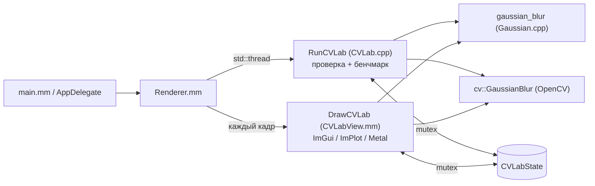

# Описание разработанной системы

Архитектура, алгоритмы, устройство кода, бенчмарка и SIMD-реализации.
Основной отчёт по пунктам задания — в [README.md](README.md).

## Содержание

1. [Архитектура](#1-архитектура)
2. [Алгоритм: фильтр Гаусса](#2-алгоритм-фильтр-гаусса)
3. [Три нативные реализации](#3-три-нативные-реализации)
4. [SIMD (ARM NEON): как это работает](#4-simd-arm-neon-как-это-работает)
5. [Бенчмарк: методика и разбор кода](#5-бенчмарк-методика-и-разбор-кода)
6. [Проверка корректности](#6-проверка-корректности)
7. [Интерфейс и потоки](#7-интерфейс-и-потоки)
8. [Отличие от «учебной» реализации](#8-отличие-от-учебной-реализации)
9. [Ограничения](#9-ограничения)

---

## 1. Архитектура



| Файл | Роль |
|---|---|
| `Image.h` | `GrayImage` (8 бит, 1 канал), режимы границы, `pad_image`, конвертация из/в `cv::Mat`. Алгоритмы от OpenCV не зависят. |
| `Gaussian.h/.cpp` | Построение ядра и три реализации фильтра: 2D, сепарабельная, сепарабельная + NEON. |
| `CVLab.h/.cpp` | Состояние (`CVLabState`), фоновый поток: загрузка изображения, проверка против OpenCV, бенчмарк, запись CSV. |
| `CVLabView.h/.mm` | Интерактивное окно на ImGui/ImPlot, загрузка картинок в Metal-текстуры. |
| `LabSelect.h` | Выбор активной лабораторной через `#define`. |
| `Renderer.mm` | Запуск фонового потока, кадровый цикл, ветвление по лабораторным. |

Принципы:

- **Алгоритм отделён от инфраструктуры.** `Gaussian.cpp` не знает про OpenCV, ImGui и потоки. OpenCV используется только для чтения файла, ресайза и как эталон.
- **Поток рендера не блокируется.** Тяжёлая работа (бенчмарк) идёт в `std::thread`. Общие данные защищены `std::mutex`, флаги (`loaded`, `bench_done`, `stop`) — `std::atomic`. UI копирует данные под мьютексом и рисует уже копию.
- **Бенчмарк пишет точки по одной.** Графики растут вживую, пока измерения идут.

---

## 2. Алгоритм: фильтр Гаусса

### 2.1. Формулы

Двумерная функция Гаусса (обратите внимание на **минус** в показателе):

$$G(x,y)=\frac{1}{2\pi\sigma^2}\,e^{-\frac{x^2+y^2}{2\sigma^2}}$$

Множитель $\frac{1}{2\pi\sigma^2}$ нормирует **непрерывную** функцию так, чтобы интеграл был равен 1. Мы берём лишь конечное число дискретных отсчётов ядра, их сумма не равна 1 в точности (сильнее всего при малых $\sigma$ и усечённом ядре). Поэтому ядро нормируется заново:

$$k_{ij}=\frac{e^{-\frac{x_i^2+y_j^2}{2\sigma^2}}}{\sum_{i,j}e^{-\frac{x_i^2+y_j^2}{2\sigma^2}}}$$

Старый множитель при этом сокращается, и в коде его можно опустить. Нормировка гарантирует $\sum k_{ij}=1$, то есть средняя яркость изображения не меняется.

### 2.2. Сепарабельность

Показатель экспоненты раскладывается в сумму, значит $G(x,y)=g(x)\,g(y)$, где

$$g(x)=\frac{1}{\sqrt{2\pi}\,\sigma}\,e^{-\frac{x^2}{2\sigma^2}}$$

Свёртка с 2D-ядром равна двум последовательным 1D-свёрткам (по строкам, затем по столбцам). Допускаются разные $\sigma_x$ и $\sigma_y$: $G(x,y)=g_{\sigma_x}(x)\,g_{\sigma_y}(y)$.

### 2.3. Свёртка

Для ядра размера $k=2r+1$:

$$\text{dst}(x,y)=\sum_{j=-r}^{r}\sum_{i=-r}^{r}G(i,j)\;\text{src}(x+i,\,y+j)$$

Строго говоря, это корреляция, но ядро симметрично, поэтому результат совпадает со свёрткой.

### 2.4. Параметры

- **Размер ядра $k$** — нечётный, $k\ge 3$. Ядро усекается на расстоянии $r$ от центра. Практическое правило: $r\approx 3\sigma$, тогда отброшенные веса пренебрежимо малы. Если $\sigma$ велика, а $k$ мало, сглаживание ограничено размером ядра.
- **$\sigma_x$, $\sigma_y$** — ширина «колокола». Если $\sigma\le 0$, она подбирается по размеру ядра (формула OpenCV):

$$\sigma = 0.3\left(\frac{k-1}{2}-1\right)+0.8$$

  Если $\sigma_y\le 0$, берётся $\sigma_y=\sigma_x$.

### 2.5. Границы

Окно у края выходит за изображение. Реализованы два режима (`Border`):

| Режим | Пример | Где используется |
|---|---|---|
| `Reflect101` | `gfe\|abcdefg\|fed` | по умолчанию, как у `cv::GaussianBlur` |
| `Replicate` | `aaa\|abcdefg\|ggg` | доступен, как у `cv::adaptiveThreshold` |

Изображение один раз дополняется рамкой шириной $r$ (`pad_image`). После этого окно любого пикселя целиком лежит в буфере, и во внутренних циклах нет проверок границ. Ветвления в горячем цикле мешают и компилятору, и SIMD.

### 2.6. Сложность

| Метод | Умножений на пиксель | Память |
|---|---|---|
| 2D | $k^2$ | padded-копия |
| Сепарабельный | $2k$ | padded-копия + float-буфер $(H+2r)\times W$ |

Выигрыш в числе операций — $\frac{k^2}{2k}=\frac{k}{2}$ раз: при $k=15$ около 7.5×, при $k=51$ около 25×. Реальное ускорение отличается: сепарабельный метод делает два прохода по памяти и пишет промежуточный буфер.

---

## 3. Три нативные реализации

Все три живут в `gaussian_blur(src, ksize, sigmaX, sigmaY, method, border)`.

### 3.1. `GaussMethod::Naive2D`

1. Строится 1D-ядра $k_x$, $k_y$, затем 2D-ядро как внешнее произведение: `k2[j*k+i] = ky[j]*kx[i]`.
2. Изображение дополняется рамкой.
3. Для каждого пикселя — два вложенных цикла по окну $k\times k$, накопление в `float`.
4. Результат округляется и ограничивается диапазоном 0…255 (`to_u8`).

Это прямая реализация формулы из п. 2.3, эталон «как в учебнике».

### 3.2. `GaussMethod::Separable`

1. **Горизонтальный проход** (`hpass_scalar`): для каждой строки *дополненного* изображения считается
   `tmp[yy][x] = Σ kx[i] · padded[yy][x+i]`.
   Строки нужны все $H+2r$, потому что вертикальному проходу понадобятся строки $y\ldots y+k-1$.
2. **Вертикальный проход** (`vpass_scalar`): `out[y][x] = Σ ky[j] · tmp[y+j][x]`.
3. Промежуточный буфер — `float`, чтобы не терять точность между проходами; округление только в конце.

Индексация `p[x+i]` корректна без сдвига на $r$: строка `p` — это дополненная строка, поэтому `p[x+i]` соответствует исходному пикселю $x+i-r$, то есть окну с центром в $x$.

### 3.3. `GaussMethod::SeparableSIMD`

Те же два прохода, но внутренний цикл по $x$ написан на ARM NEON. Подробнее в разделе 4. На архитектуре без NEON (например, Intel Mac) код откатывается на скалярные функции, и результат совпадёт с `Separable`.

---

## 4. SIMD (ARM NEON): как это работает

### 4.1. Идея

SIMD (Single Instruction, Multiple Data) — одна инструкция обрабатывает сразу несколько значений. Регистр NEON имеет ширину 128 бит. В нём помещается 4 числа `float32` (`float32x4_t`) или 16 байт (`uint8x16_t`). Одна инструкция fused multiply-add выполняет 4 умножения-сложения.

### 4.2. По какой оси векторизуем

Векторизация идёт **по $x$**, то есть мы считаем сразу несколько соседних выходных пикселей. Это удобно по трём причинам:

- Соседние выходные пиксели независимы, зависимостей между «полосами» нет.
- Один и тот же вес ядра `kx[i]` нужен всем полосам, он «размножается» (`vfmaq_n_f32` умножает вектор на скаляр).
- Нет горизонтальных редукций (сложения элементов внутри вектора), которые дороги. Если бы мы векторизовали по окну ядра, пришлось бы в конце суммировать лейны.

Размер ядра на эффективность почти не влияет: меняется только длина внутреннего цикла по $i$.

### 4.3. Горизонтальный проход (`hpass_simd`)

За итерацию обрабатываются **8 пикселей** (`x += 8`), для них нужно два регистра-аккумулятора `a0`, `a1`:

```
для i = 0 .. k-1:
    v8  = vld1_u8(p + x + i)                  // загрузка 8 байт (невыровненная)
    v16 = vmovl_u8(v8)                        // uint8  -> uint16 (8 штук)
    f0  = vcvtq_f32_u32(vmovl_u16(low(v16)))  // нижние 4: uint16 -> uint32 -> float
    f1  = vcvtq_f32_u32(vmovl_u16(high(v16))) // верхние 4
    a0  = vfmaq_n_f32(a0, f0, kx[i])          // a0 += f0 * kx[i]  (4 лейна)
    a1  = vfmaq_n_f32(a1, f1, kx[i])
```

После цикла по $i$ результат сохраняется в `tmp` (`vst1q_f32` два раза).

Что важно:

- **Расширение типа.** Пиксели 8-битные, а считаем в `float`. Цепочка `u8 → u16 → u32 → f32` нужна, потому что у NEON нет прямого перехода `u8 → f32`.
- **Невыровненные загрузки.** Адрес `p + x + i` при каждом $i$ сдвигается на 1 байт, поэтому выровненной загрузки быть не может. На современных ARM-ядрах штраф за невыровненный доступ внутри кэш-линии мал.
- **Проверка границ чтения.** Последнее чтение — `p[x+7+(k-1)]`. Пока `x+8 ≤ w`, это не больше `w+k-2`, а ширина дополненной строки равна `w+2r = w+k-1`. Выхода за буфер нет.
- **Хвост.** Если `w` не кратно 8, оставшиеся пиксели (<8) досчитываются скалярной функцией `hpass_scalar(..., x0)`.

### 4.4. Вертикальный проход (`vpass_simd`)

Здесь загрузка проще: для фиксированных $y$ и $j$ нужные значения лежат подряд в строке `tmp`.

```
для j = 0 .. k-1:
    t  = tmp + (y+j)*w + x
    a0 = vfmaq_n_f32(a0, vld1q_f32(t),     ky[j])
    a1 = vfmaq_n_f32(a1, vld1q_f32(t + 4), ky[j])
```

Преобразование в 8 бит в конце:

```
vcvtnq_s32_f32     float32 -> int32, округление к ближайшему
vqmovn_s32         int32   -> int16 с насыщением (два вектора -> vcombine_s16)
vqmovun_s16        int16   -> uint8 с насыщением снизу и сверху (0..255)
vst1_u8            запись 8 байт
```

Насыщающие инструкции заменяют скалярный `clamp`. Округление: NEON-версия округляет «к ближайшему чётному» (`vcvtn`), скалярная — прибавлением 0.5. Они могут отличаться на 1 уровень яркости только при значении ровно на границе.

### 4.5. Что даёт и чего не даёт SIMD

- Теоретически на 4 лейнах `float32` можно получить до 4× по арифметике. На практике ниже, потому что проход ограничен **пропускной способностью памяти**, а не вычислениями: промежуточный буфер для кадра 1920×1080 при $k=15$ занимает $(1080+14)\cdot1920\cdot4\approx 8.4$ МБ, это больше кэшей первого и второго уровня.
- Идея оптимизации, которая здесь не реализована: слить два прохода по полосам (tiling), чтобы промежуточные данные оставались в кэше. Это можно упомянуть в выводах как направление развития.
- Компилятор может частично векторизовать и скалярный код автоматически (`-O3`). Поэтому сравнение «Separable vs Separable SIMD» показывает выигрыш именно ручной оптимизации *сверх* автовекторизации, и он может быть скромным.
- OpenCV быстрее наших реализаций: у него SIMD на целых числах (не `float`), многопоточность (GCD) и оптимизированные HAL-слои для ARM.

---

## 5. Бенчмарк: методика и разбор кода

### 5.1. Что измеряется

В `CVLab.cpp` два эксперимента, оба по четырём реализациям: **2D**, **separable**, **separable SIMD**, **OpenCV**.

| Эксперимент | Что меняется | Что фиксировано |
|---|---|---|
| Время vs размер ядра | $k\in\{3,5,7,9,11,15,21,31,41,51\}$ | кадр шириной 1280 px, $\sigma$ — авто |
| Время vs размер кадра | ширина $\in\{320,640,960,1280,1920\}$ | $k=15$, $\sigma$ — авто |

Кадры разных размеров получаются из одного исходного уменьшением `cv::resize(..., INTER_AREA)`, поэтому содержимое сопоставимо.

### 5.2. Функция измерения времени

```cpp
template <class F>
double time_ms(F&& f, int reps) {
    f();                                   // прогрев
    for each of reps: измерить f() через std::chrono::steady_clock
    sort; return t[reps/2];                // медиана
}
```

- **Прогрев.** Первый запуск холодный: промахи кэша, ленивые аллокации, подгрузка кода. Его выбрасываем.
- **Медиана, а не среднее.** Одиночные выбросы (прерывания ОС, другой процесс, троттлинг) не портят результат.
- **`steady_clock`.** Монотонные часы, не прыгают при коррекции системного времени.
- **Число повторов.** Для 2D — 3 (одиночный вызов может занимать секунды), для остальных — 7.

### 5.3. Защита от «выкидывания» вычислений

```cpp
volatile uint8_t g_sink = 0;
g_sink = gaussian_blur(...).px[0];
```

Если результат нигде не используется, компилятор вправе удалить вызов. Запись одного пикселя результата в `volatile`-переменную запрещает это, не добавляя заметной работы.

### 5.4. Что входит в измеряемое время

Каждый вызов делает всё внутри себя: строит ядро, дополняет изображение, выделяет промежуточный и выходной буферы, считает. Для OpenCV тоже измеряется полный вызов `cv::GaussianBlur` с выделением `dst`. То есть сравниваются «целые вызовы», как их увидит пользователь, а не только вычислительные циклы.

### 5.5. Ограничения методики (важно для честного сравнения)

- **Нативные реализации однопоточные.** OpenCV может использовать несколько потоков и аппаратно-специфичные оптимизации. Поэтому ускорение OpenCV нельзя целиком приписывать качеству алгоритма.
- **Наивная 2D свёртка при $k>31$ пропускается** — на кадре 1280 px она занимает секунды, и бенчмарк завис бы. На графике у этой серии просто нет точек.
- **Только Release.** В Debug отсутствует оптимизация, цифры бессмысленны.
- **Время зависит от машины:** тактовая частота, троттлинг, фоновая нагрузка. Перед замерами лучше закрыть тяжёлые программы и подключить питание.
- **В интерфейсе** время считается **одиночным** замером при каждом изменении ползунка (без прогрева и медианы), оно нужно для наглядности, а не для отчёта. Цифры для отчёта берутся из CSV.

### 5.6. Выходные данные

Файлы `bench_gauss_vs_ksize.csv` и `bench_gauss_vs_size.csv` (в рабочей папке запуска), формат: `method,x,ms`. Те же данные рисуются в ImPlot в логарифмическом масштабе по оси времени, так как значения различаются на два порядка.

---

## 6. Проверка корректности

Перед бенчмарком фоновый поток сравнивает нативные реализации с `cv::GaussianBlur` при одинаковых параметрах на кадре шириной 640 px:

- наборы $(k,\sigma_x,\sigma_y)$: $(3,0,0)$, $(7,1.5,1.5)$, $(15,0,0)$, $(15,3,1)$, $(31,5,5)$, $(51,0,0)$;
- для каждого набора — 2D (если $k\le 31$), separable и SIMD;
- метрики: максимальная абсолютная разница $\max|a-b|$ и доля несовпавших пикселей.

Ожидаемый результат: разница не больше 1 уровня яркости. Причина: OpenCV для 8-битных изображений использует другую арифметику (насколько мне известно, целочисленную/с фиксированной точкой на части путей) и другое округление, поэтому совпадение побитовое невозможно, но расхождение на единицу допустимо.

В интерфейсе третья картинка показывает $|\text{native}-\text{OpenCV}|\times 40$ (усиление, иначе разницу в 1 уровень не видно).

---

## 7. Интерфейс и потоки

- Окно построено на ImGui + ImPlot, картинки выводятся как Metal-текстуры (`MTLTexture`, формат RGBA8; серое изображение при загрузке конвертируется в RGBA).
- Ползунки: метод, $k$ (всегда нечётный: `ksize |= 1`), $\sigma_x$, $\sigma_y$. Эффективные значения $\sigma$ (после авто-подбора) выводятся рядом.
- Пересчёт происходит только при изменении параметров (флаг `dirty`), а не каждый кадр.
- Защита от зависания: 2D-метод пропускается, если $W\cdot H\cdot k^2 > 2\cdot10^9$, выводится предупреждение.
- Отдельный график показывает веса 1D-ядра — наглядно видно влияние $\sigma$ и $k$.
- При закрытии приложения выставляется `stop`, фоновый поток завершается, затем `join()`.

---

## 8. Отличие от «учебной» реализации

Типичный учебный пример (`vector<vector<double>>`, два вложенных цикла, ядро через `exp`) реализует **ту же математику** — он эквивалентен нашему `Naive2D`. Различия практические:

| Аспект | Учебный пример | Эта работа |
|---|---|---|
| Хранение | `vector<vector<double>>` — каждая строка отдельно в куче, плохая локальность | непрерывный буфер `uint8_t`, строка за строкой |
| Границы | пиксели у края **пропускаются** (остаются 0), результат неполный | рамка Reflect101/Replicate, обрабатывается весь кадр |
| Параметры | один $\sigma$ | $\sigma_x$, $\sigma_y$ раздельно, авто-подбор |
| Тип | `double` | 8-битные пиксели, `float` для накопления, округление и насыщение |
| Алгоритм | только 2D, $O(k^2)$ | 2D, сепарабельный $O(2k)$, SIMD |
| Проверка | визуальная, на матрице 7×7 | сравнение с OpenCV, метрики, бенчмарк |

Две мелочи в формулах учебного примера:

- в записи $G=\frac{1}{2\pi\sigma^2}e^{\frac{x^2+y^2}{2\sigma^2}}$ пропущен **минус** в показателе (в коде он есть: `-(x*x+y*y)/(2σ²)`); без минуса функция росла бы от центра;
- множитель $\frac{1}{2\pi\sigma^2}$ в коде опущен намеренно: после нормировки он всё равно сокращается.

---

## 9. Ограничения

- NEON-ветка работает только на ARM (Apple Silicon). На Intel выполняется скалярный код.
- Только 8-битные изображения в градациях серого. Цветное изображение придётся обрабатывать по каналам.
- Нативные реализации однопоточные.
- Нет слияния проходов (tiling), поэтому на больших кадрах сепарабельный метод ограничен памятью.
- Бенчмарк не учитывает энергопотребление и влияние температуры.
