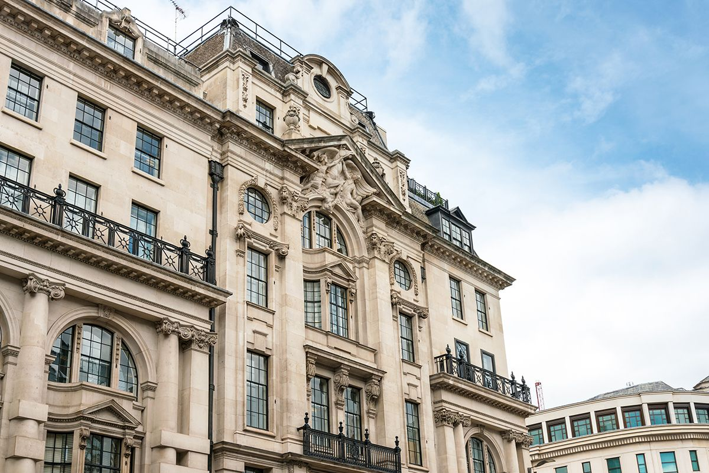
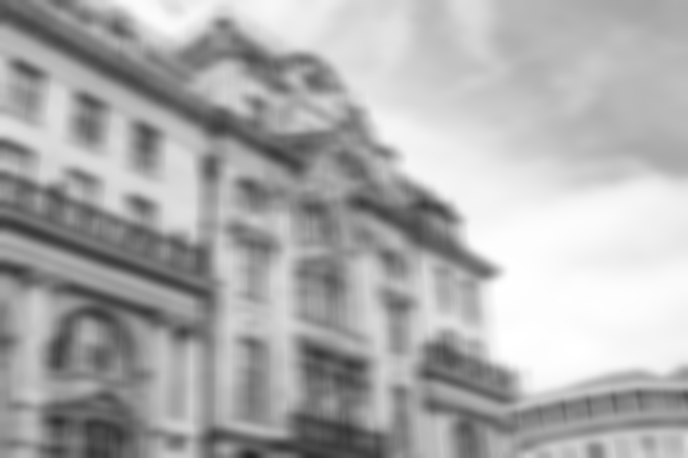
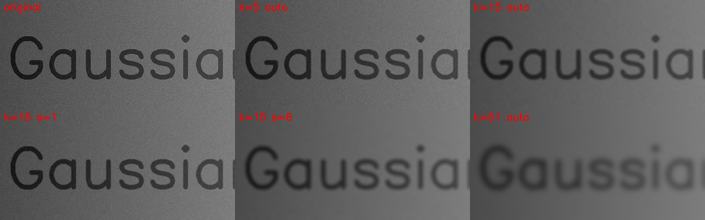
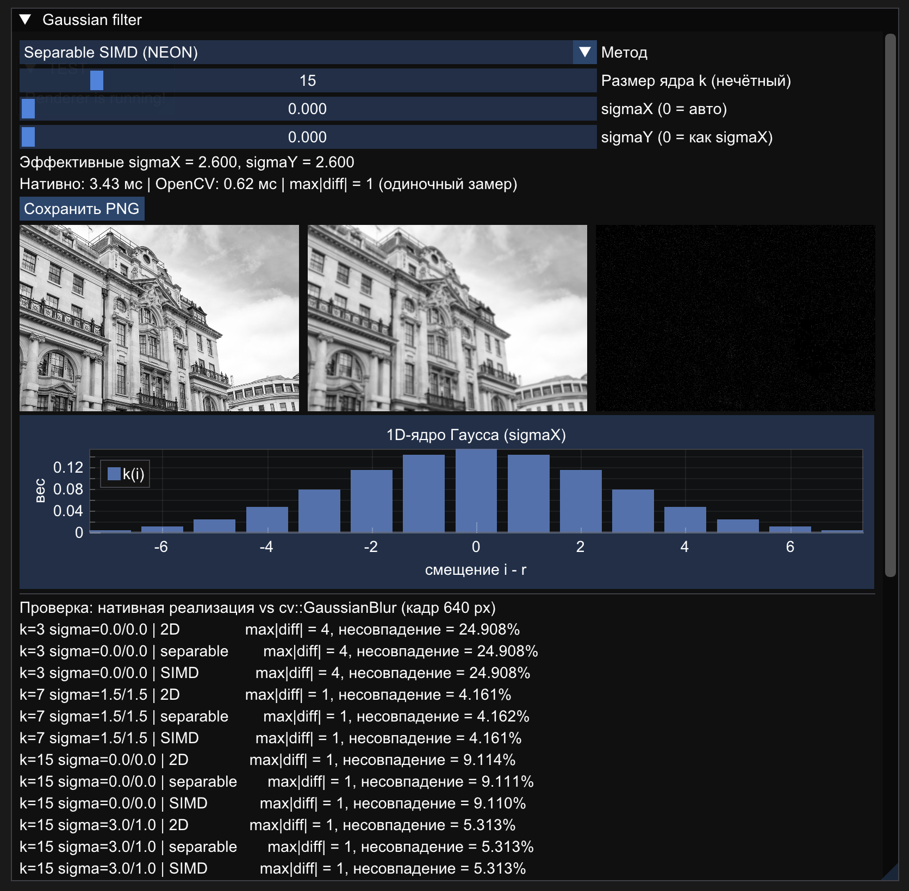
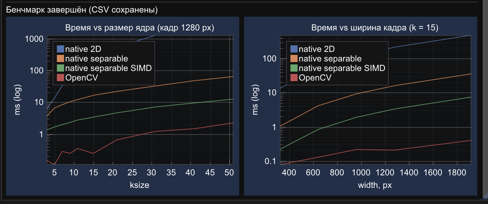
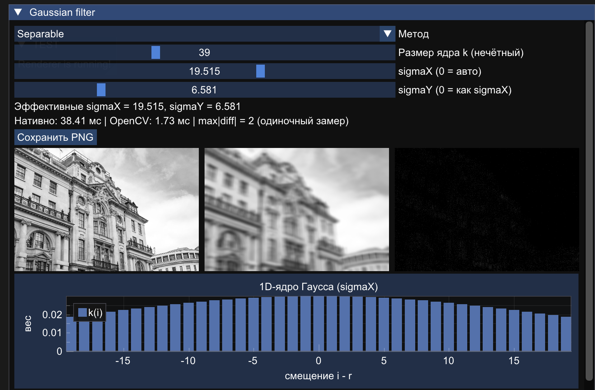
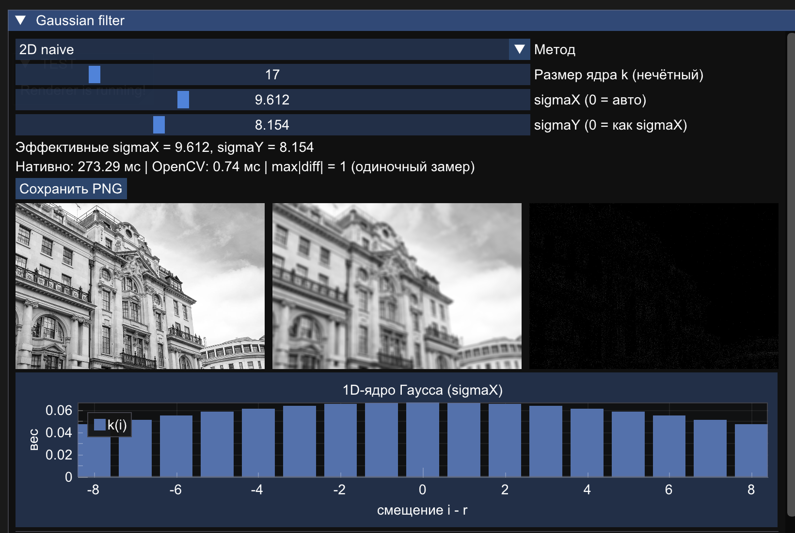

# Усредняющий фильтр Гаусса с переменным размером ядра и параметрами гауссианы

**Цель работы:** научиться реализовывать простой алгоритм обработки изображений, реализовать его двумя способами (встроенные функции библиотеки и нативно на C++) и сравнить быстродействие.

**Вариант:** усредняющий фильтр Гаусса с переменным размером ядра $k$ и параметрами гауссианы $\sigma_x$, $\sigma_y$.

**Стек:** C++17, OpenCV (эталон, ввод-вывод), ARM NEON (SIMD), ImGui + ImPlot + Metal (интерфейс), macOS / Xcode.

> Подробное описание архитектуры, кода, SIMD и бенчмарка — в [DESCRIPTION.md](DESCRIPTION.md).

## Содержание

1. [Теоретическая база](#1-теоретическая-база)
2. [Описание разработанной системы](#2-описание-разработанной-системы)
3. [Результаты работы и тестирования](#3-результаты-работы-и-тестирования)
4. [Выводы](#4-выводы)
5. [Использованные источники](#5-использованные-источники)
6. [Сборка и запуск](#сборка-и-запуск)

---

## 1. Теоретическая база

### 1.1. Сглаживание и гауссиан

Сглаживающий (низкочастотный) фильтр заменяет каждый пиксель взвешенным средним его окрестности. Это подавляет шум, но размывает границы. Фильтр Гаусса задаёт веса гауссианой, поэтому ближние пиксели важнее дальних, а результат не даёт характерных «квадратных» артефактов равномерного усреднения.

Двумерная функция Гаусса:

$$G(x,y)=\frac{1}{2\pi\sigma^2}\,e^{-\frac{x^2+y^2}{2\sigma^2}}$$

В показателе стоит **минус**: вес убывает с расстоянием от центра. Множитель $\frac{1}{2\pi\sigma^2}$ нормирует непрерывную функцию. У дискретного усечённого ядра сумма весов не равна 1, поэтому ядро нормируют заново, и исходный множитель сокращается:

$$k_{ij}=\frac{e^{-\frac{x_i^2+y_j^2}{2\sigma^2}}}{\sum_{i,j}e^{-\frac{x_i^2+y_j^2}{2\sigma^2}}},\qquad \sum k_{ij}=1$$

Условие $\sum k_{ij}=1$ означает, что средняя яркость изображения сохраняется.

### 1.2. Дискретная свёртка

Для ядра размера $k=2r+1$:

$$\text{dst}(x,y)=\sum_{j=-r}^{r}\sum_{i=-r}^{r}G(i,j)\;\text{src}(x+i,\,y+j)$$

Ядро симметрично, поэтому корреляция и свёртка дают одинаковый результат.

### 1.3. Сепарабельность

Показатель экспоненты раскладывается в сумму, откуда $G(x,y)=g_{\sigma_x}(x)\cdot g_{\sigma_y}(y)$, где

$$g_\sigma(t)=\frac{1}{\sqrt{2\pi}\,\sigma}\,e^{-\frac{t^2}{2\sigma^2}}$$

Следовательно, 2D-свёртка равна двум 1D-свёрткам (по строкам, затем по столбцам). Число умножений на пиксель падает с $k^2$ до $2k$, то есть в $k/2$ раз.

### 1.4. Параметры гауссианы

- **$\sigma$** задаёт ширину «колокола»: чем больше, тем сильнее сглаживание.
- **$k$** определяет, где ядро обрезается. Обычно берут $r\approx 3\sigma$ ($k\approx 6\sigma+1$): за пределами $3\sigma$ остаётся около 0.3 % массы одномерной гауссианы.
- Если $k$ мало, а $\sigma$ велика, эффективное сглаживание ограничено размером ядра. Если $k$ велико, а $\sigma$ мала, лишние веса почти нулевые, и время тратится впустую.
- При $\sigma\le0$ значение подбирается по размеру ядра (формула OpenCV): $\sigma=0.3\left(\frac{k-1}{2}-1\right)+0.8$.

### 1.5. Границы изображения

У края окно выходит за пределы кадра. Используется отражение `Reflect101` (`gfe|abcdefg|fed`, как у `cv::GaussianBlur` по умолчанию). Дополнительно реализовано `Replicate` (`aaa|abcdefg|ggg`).

---

## 2. Описание разработанной системы

Кратко; полное описание — в [DESCRIPTION.md](DESCRIPTION.md).

### 2.1. Реализации алгоритма

| Реализация | Суть | Сложность на пиксель |
|---|---|---|
| **OpenCV** (`cv::GaussianBlur`) | эталон (библиотечная функция) | — |
| **Native 2D** | прямая свёртка с 2D-ядром $k\times k$ | $O(k^2)$ |
| **Native separable** | два 1D-прохода, промежуточный `float`-буфер | $O(2k)$ |
| **Native separable SIMD** | то же, внутренний цикл на ARM NEON (8 пикселей за итерацию) | $O(2k)$, SIMD-вектор |

Общие приёмы:

- изображение один раз дополняется рамкой шириной $r$, поэтому во внутренних циклах нет проверок границ;
- накопление в `float`, округление и насыщение в `uint8` один раз в конце;
- NEON: векторизация по $x$ (соседние выходные пиксели независимы), `vfmaq_n_f32` для умножения вектора на скалярный вес, насыщающие инструкции для преобразования обратно в 8 бит; на не-ARM архитектурах — скалярный запасной путь.

### 2.2. Архитектура

```
main.mm → AppDelegate → Renderer.mm ─┬─ std::thread → RunCVLab (проверка + бенчмарк → CSV)
                                     └─ каждый кадр → DrawCVLab (ImGui / ImPlot / Metal)
Gaussian.cpp / Image.h — алгоритмы, не зависят от OpenCV и UI
CVLabState — общее состояние (mutex + atomic)
```

Фоновый поток не блокирует интерфейс. Точки бенчмарка добавляются по одной, поэтому графики растут в реальном времени.

### 2.3. Интерфейс

Окно показывает исходное изображение, результат и карту разницы с OpenCV ($\times40$). Ползунки: метод, размер ядра $k$, $\sigma_x$, $\sigma_y$. Также выводятся график весов 1D-ядра, таблица проверки и графики бенчмарка. Кнопка «Сохранить PNG» сохраняет текущий результат.

---

## 3. Результаты работы и тестирования

| | |
|---|---|
|  | |
### 3.1. Визуальный результат

Фрагмент синтетического тестового изображения (градиент, текст, гауссов шум $\sigma_n=8$):



Закономерности:

- `k=5` (авто-$\sigma$): шум заметно подавлен, текст почти не размыт.
- `k=15`, авто-$\sigma=2.6$ и `k=15, σ=1`: при одинаковом $k$ уменьшение $\sigma$ даёт более слабое сглаживание, ядро фактически «уже» окна.
- `k=15, σ=6`: $\sigma$ велика для данного ядра ($3\sigma=18>r=7$), ядро усечено и близко к равномерному усреднению. Края размыты сильно.
- `k=51` (авто-$\sigma=8.0$): текст едва читается, фон гладкий.

**Скриншоты интерфейса**:

| | |
|---|---|
|  |  |
|  |  |

k=39 при σ=19.5: график ядра почти плоский. Это иллюстрация того, что при σ ≫ k/6 ядро усечено и фильтр превращается в равномерное усреднение. К тому же σx≠σy даёт анизотропное размытие.
k=15, σ авто: нормальный «колокол», хороший пример.
Карта разницы почти чёрная, то есть отличие от OpenCV визуально незаметно.

### 3.2. Проверка корректности

Сравнение с `cv::GaussianBlur`, кадр 640 px:

| Параметры | Метод | max \|diff\| | Несовпавших пикселей |
|---|---|---|---|
| k=3, σ авто | 2D / separable / SIMD | 4 | 24.9 % |
| k=7, σ=1.5 | 2D / separable / SIMD | 1 | 4.2 % |
| k=15, σ авто | 2D / separable / SIMD | 1 | 9.1 % |
| k=15, σx=3, σy=1 | 2D / separable / SIMD | 1 | 5.3 % |
| k=31, σ=5 | 2D / separable / SIMD | 1 | 7.9 % |
| k=51, σ авто | separable / SIMD | 2 | 8.1 % |

Нативные реализации отличаются от OpenCV **не более чем на 1 уровень яркости** на малой доле пикселей. Причина — разная арифметика и округление (по моим сведениям, OpenCV на 8-битных данных использует целочисленные ядра с фиксированной точкой; для $k=3$ при авто-$\sigma$ у него отдельный путь, возможно поэтому там больше расхождений). Для задачи сглаживания такая разница несущественна.

### 3.3. Быстродействие

Время от ширины кадра ($k=15$):

| Ширина, px | Native 2D | Native separable | OpenCV |
|---|---|---|---|
| 320 | 7.905 | 0.666 | 0.044 |
| 640 | 32.09 | 2.600 | 0.125 |
| 960 | 71.50 | 5.703 | 0.116 |
| 1280 | 126.5 | 10.15 | 0.140 |
| 1920 | 290.2 | 23.33 | 0.292 |

Время от размера ядра ($кадр=1280px$):

| k | Native 2D | Native separable | Native separable SIMD | OpenCV |
|---|---|---|---|---|
| 3 | 3.68 | 3.11 | 0.85 | 0.04 |
| 5 | 8.81 | 4.21 | 1.06 | 0.13 |
| 15 | 128.32 | 10.146 | 2.12 | 0.185 |
| 31 | 757.88 | 20.440 | 4.40 | 0.738 |

### 3.4. Наблюдаемые закономерности

1. **2D растёт примерно как $exp(k)$.** От $k=15$ к $k=31$ (вдвое) время выросло с 128 до 757 мс, то есть в ~5 раз.
2. **Separable растёт примерно линейно по $k$** (от 15 к 31: 2.1 → 4.4 мс, ~1.8×).
3. **Выигрыш separable над 2D** растёт с $k$: от ~2× при $k=3$ до ~19× при $k=31$. Теоретически он равен $k/2$ (≈15.5 при $k=31$); измеренное значение отличается от него, так как у обоих методов есть накладные расходы (дополнение рамкой, промежуточный буфер, второй проход по памяти), а внутренний цикл 2D компилятор оптимизирует иначе.
4. **Время линейно по числу пикселей** (от 320 до 1920 px по ширине площадь растёт в 36 раз, время separable — в ~41 ра).
5. **OpenCV быстрее** лучшей нативной реализации примерно в 6–100 раз (разрыв сокращается с ростом $k$, но только для separable, в основном для separable SIMD). Это ожидаемо: оптимизированные целочисленные SIMD-ядра, многопоточность, отсутствие лишних проходов.

---

## 4. Выводы

1. Реализован фильтр Гаусса с настраиваемыми размером ядра и $\sigma_x$, $\sigma_y$ тремя нативными способами и через OpenCV. Нативные результаты совпадают с `cv::GaussianBlur` с точностью до 1 уровня яркости.
2. Использование сепарабельности снижает сложность с $O(k^2)$ до $O(k)$ на пиксель и даёт ускорение, растущее с размером ядра (до ~19× при $k=31$).
3. Параметры сглаживания нужно согласовывать: размер ядра должен быть порядка $6\sigma+1$. Слишком маленькое ядро ограничивает сглаживание, слишком большое лишь тратит время.
4. Ручная SIMD-оптимизация внутреннего цикла даёт ограниченный выигрыш, потому что проход упирается в пропускную способность памяти (промежуточный `float`-буфер превышает кэш). Дальнейшие улучшения — слияние проходов по полосам (tiling), целочисленная арифметика, многопоточность. (SIMD быстрее скалярного separable в ~11× при $k=15$)
5. Библиотечная реализация остаётся заметно быстрее нативной. Часть разрыва — многопоточность и аппаратно-специфичные оптимизации, а не качество самого алгоритма.

---

## 5. Использованные источники

1. Gonzalez R., Woods R. *Digital Image Processing*, 4th ed. Pearson, 2018 — глава о пространственной фильтрации и сглаживании.
Computer Vision Algorithms and Applications Richard Szeliski September 7, 2009
2. Szeliski R. *Computer Vision: Algorithms and Applications*, 2009 — разделы о линейной фильтрации и сепарабельных ядрах.
3. Документация OpenCV: `cv::GaussianBlur`, `cv::getGaussianKernel` — https://docs.opencv.org
4. Arm. *Neon Intrinsics Reference* — https://developer.arm.com/architectures/instruction-sets/intrinsics
5. Документация Dear ImGui и ImPlot — https://github.com/ocornut/imgui, https://github.com/epezent/implot

---

## Сборка и запуск

1. Собрать OpenCV из исходников (модули `core`, `imgproc`, `imgcodecs`, `-DBUILD_SHARED_LIBS=ON`, `-DCMAKE_INSTALL_PREFIX=$HOME/opencv-install`) и выполнить `cmake --install .`.
2. В Xcode: C++17, ARC включён, Header Search Paths — `$(HOME)/opencv-install/include/opencv4` (проверьте реальное имя папки), Library Search Paths и Runpath — `$(HOME)/opencv-install/lib`, Other Linker Flags — `-lopencv_core -lopencv_imgproc -lopencv_imgcodecs`.
3. В `LabSelect.h` оставить `#define USE_CV_PIPELINE`.
4. Собирать и запускать в конфигурации **Release**, рабочая папка — папка проекта (туда пишутся CSV и PNG).
5. Путь к входному изображению — `kInputPath` в `CVLab.cpp`; если файла нет, строится синтетическое изображение.